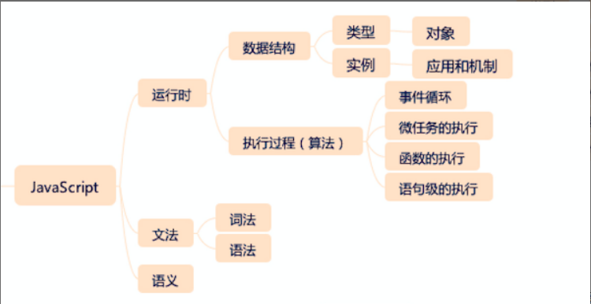
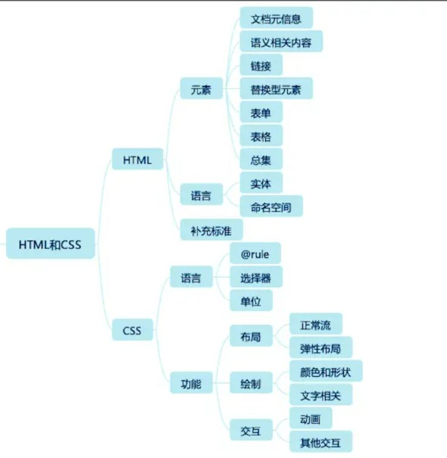
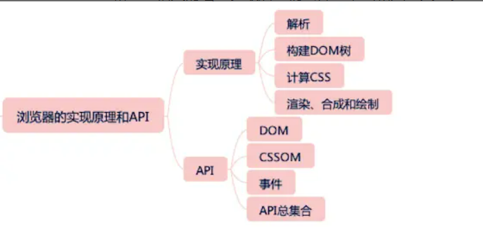
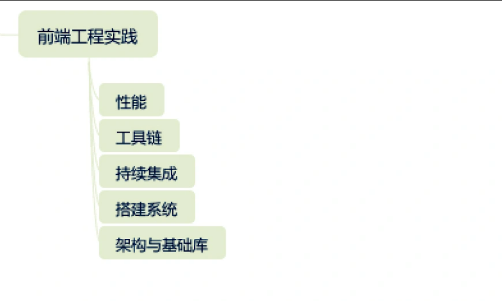

# 重学前端笔记
**JavaScript - 用规定的文法，去表达一定的语义，最终操作运行时**
```
1、文法
    词法
    语法
2、语义
3、运行时：程序 = 数据结构 + 算法 -> 对运行时来说，类型就是数据结构，执行过程就是算法
    类型
    执行过程
```

**知识架构图**
- 
    - 数据结构：
        - 类型：number string boolean symbol undefined null object
        - 实例：List和Record、Set、Completion Record、Reference、Property Descriptor、Lexical Environment和Environment Record、Data Block
- 
-  
- 

## JavaScript模块

### JavaScript类型

#### Undefined
- 表示`未定义`
- 任何变量在赋值之前都是Undefined类型，值为`undefined`
- 因为JavaScript的代码undefined是一个变量而非一个关键字，所以，我们为了避免无意中被篡改，建议使用`viod 0`来获取`undefined`值（undefined被赋值，还是undefined，没有被改变 --- **ES5之前，undefined可以被赋值，现代浏览器已经吧undefined设置为一个non-configurable、non-writable属性的值了**）
- 为什么有的变成规范要求使用`void 0`代替`undefined`？
    - undefined不是一个关键字，避免无意篡改，使用`void 0`

#### Null
- 表示`定义了但是为空`
- Null类型也只有一个值，`null`
- null 是一个关键字

#### Boolean
- true
- false

#### String
- 字符串有最大长度吗？
- String有最大长度`2^53-1`，`但这个最大长度，并不是字符数，而是字符串的UTF16编码`
- 对字符串的操作：charAt、charCodeAt、length等方法针对的都是UTF16编码
- 字符串是永远无法变更的，一旦构造出来，无法使用任何方式改变字符串的内容 -- 字符串字面量的值不可变，可重新赋值

#### Number
- 0.1 + 0.2 不是等于 0.3 吗？为什么JavaScript里面不是这样的？
- 非整数的Number类型无法用`==(或===)`来比较。正确比较浮点数的方法 -- 检查等式两边的差的绝对值是否小于最小精度 -- `console.log(Math.abs(0.1 + 0.2) <= Number.EPSILON)`

#### Symbol
- ES6新加入的Symbol是个什么东西？
- 创建：`var mySymbol = Symbol('my symbol')` -- 可以有字符串描述，字符串描述相同的，symbol值也不同
- 

#### Object
- 为什么给对象添加的方法能用在基本类型上？
    - `.`运算符提供了装箱操作，它会根据基础类型构造一个临时对象，使得我们能在基础类型上调用对应对象的方法
- 对象 -- 属性的集合 -- 数据属性 + 访问器属性

#### 类型转换

##### StringToNumber
- parseInt：在不传入第二个参数的情况下，只支持16进制前缀`0x`，会忽略非数字。任何时候使用，都建议传入第二个参数
- parseFloat：只有十进制的解析规则

##### 装箱转换
- 把基本类型转换为对应的对象。
- 全局的Symbol函数无法使用new来调用 -- 使用一个函数的call方法来强迫产生装箱
    ```
    var symbolObject = (function () { return this }).call(Symbol('a'))

    console.log(typeof symbolObject) // object
    console.log(symbolObject instanceof Symbol) // true

    var symbolObject1 = Object(Symbol('2'))
    ```
- 装箱机制会频繁的产生临时对象，在一些对性能要求比较高的场景下，应该尽量避免对基本类型做装箱转换
- 每一类装箱对象，都有私有的class属性，这些属性可以使用`Object.prototype.toString.call()`获取。该方法可以准确识别对象对应的基本类型的方法，比`instanceOf`更加准确

##### 拆箱转换
- ToPrimitive函数 - 对象到基本类型的转换
- 拆箱转换会尝试调用valueOf和toString来获得拆箱后的基本类型。如果valueof和toString都不存在，抛出typeError
- 规范指出：类型转换的内部实现是通过`ToPrimitive(input [, PreferredType])`方法进行转换的，这个方法的作用就是将input转为一个非对象类型，参数`PreferredType`是可选的，指出了input期望被转成的类型，不传则默认为number；如果`PreferredType`的值是`string`，那就`先执行toString后执行valueOf`，否则`先执行valueOf后执行toString`

### JavaScript对象

## HTML和CSS

## 浏览器实现原理API

## 前端综合应用