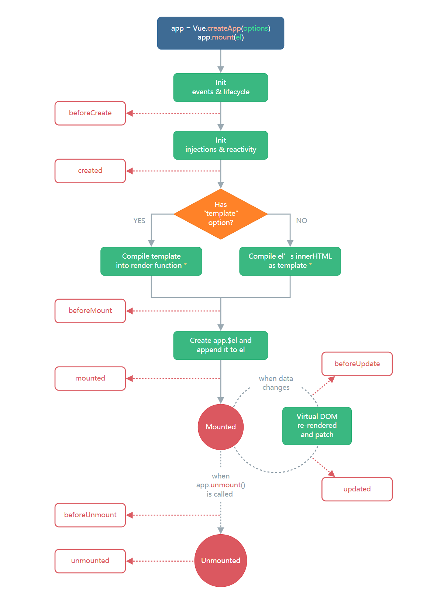
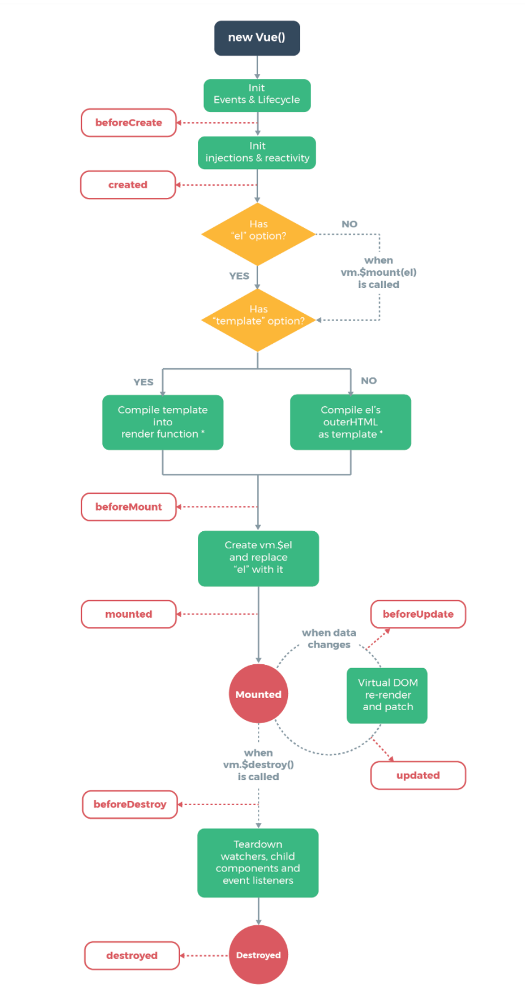

# vue3

`导入`
```
// vue3
import { createApp } from 'vue';

// vue2
import Vue from 'vue';
```

`挂载`
```
// vue3
// 链式回调，除了mount，每一个方法都会返回实例本身，可以一直接着调用
// mount不返回应用本身，返回的是跟组件实例
Vue.createApp(App).mount('#app');
const vm = Vue.createApp(App).mount('#app');

// vue2
new Vue({
    el: 'app',
    router,
    store,
    render: h => h(App)
})
```

`组件注册`
```
// vue3
const app = Vue.createApp(App);
app.component('cu-component', myComponent);

// vue2
Vue.component('cu-component', myComponent);
```

`Vue实例`
```
// vue3
const app = Vue.createApp({
    /* 选项 */
})

app.component('my-component', myComponent);
app.directive('focus', FocusDirective);
app.use(LocalePlugin);
    |
    |
    V
Vue.createApp({}).component(...).directive(...).use(...) // 链式调用

// vue2
Vue.component(...);
Vue.directive(...);
Vue.use(...);
```

`生命周期`

- [生命周期](https://juejin.cn/post/6945606524987244558)
- 创建 + 挂载 + 更新 + 销毁
- vue3生命周期

    

- vue2生命周期

    

- `keep-alive`
    - 包裹动态组件时，会缓存不活动的组件实例，而不是销毁它们。keep-alive是一个抽象组件，它自身不会渲染一个DOM元素，也不会出现在父组件链中。
    - 增加两个生命周期：
        - activated: 激活时调用
        - deactivted：停用时调用

- vue2、vue3比较
    - 替换的生命周期
        - beforeCreate      ---     setup()
        - created           ---     setup()
    - 重命名
        - beforeMount       ---     onBeforeMount
        - mounted           ---     onMounted
        - beforeUpdated     ---     onBeforeUodated
        - updated           ---     onUpdated
        - beforeDestory     ---     onBeforeUnmount
        - destoryed         ---     onUnmounted
        - errorCaptured     ---     onErrorCaptured
            - 当捕获一个来自子孙组件的错误时被调用
            - 参数：错误对象、发生错误的组件实例、包含错误来源信息的字符串
            - 返回 `false` 阻止错误继续向上传递
        - activated         ---     onActivated
        - deactivated       ---     onDeactivated
    - 新增的（调试用的）
        - onRenderTracked
        - onRenderTriggered
    - vue3向下兼容vue2；vue3中没有beforeDestory、destroyed两个钩子

- 父子组件的生命周期
    - 渲染阶段：
        - 父beforeCreate - 父created - 父beforeMount - 子beforeCreate - 子created - 子beforeMount - 子mounted - 父mounted
    - 更新阶段
        - 父beforeUpdate - 子beforeUpdate - 子updated - 父updated
    - 销毁阶段
        - 父beforeDestory(onBeforeUnmount) - 子beforeDestory(onBeforeUnmount) - 子destoryed(onUnmount) - 父destroyed(onUnmount)

`渲染函数(render)`