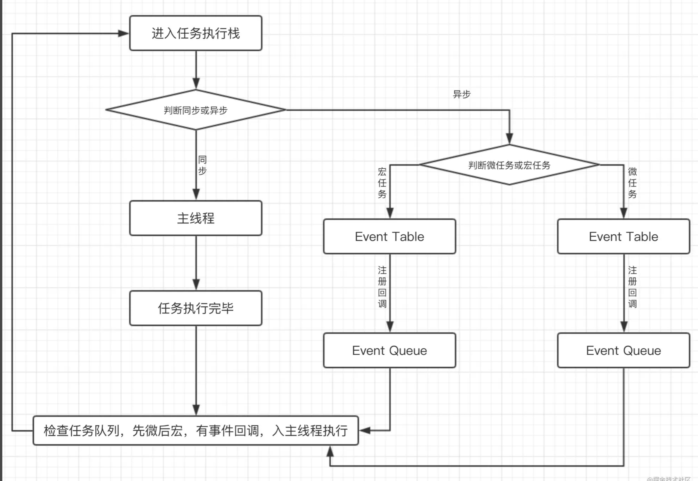

# 宏任务与微任务
宏任务执行后，会执行渲染，在执行下一个宏任务，而微任务可以理解为在当前宏任务执行后，立即执行的任务。
`宏任务 --- 微任务 --- GUI渲染 --- 宏任务`

- JavaScript有同步/异步任务的概念，同步任务在主线程上执行，会形成一个`执行栈`，主线程之外，事件触发线程管理着一个`任务队列`，只要异步任务有了运行结果，就在任务队列之中放一个事件回调。一旦`执行栈`中的所有同步任务执行完毕，就会读取`任务队列`，将可以执行的异步任务添加到执行栈中，开始执行
## 宏任务
- 主代码块
- setTimeout
- setInterval
- setImmidiate() --- node
- requestAnimationFrame --- 浏览器

## 微任务
- process.nextTick() -- node
- promise.then()
- catch
- finally
- Object.observe
- MutationObserver

## 事件循环-EventLoop


整体的script开始执行的时候，作为第一个宏任务执行，会把所有的代码分为`同步任务`，`异步任务`两部分，同步任务会直接进入主线程依次执行，异步任务会再分为宏任务和微任务。当主线程内的任务执行完毕，主线程为空时，会检查微任务的Event Queue,如果有任务就全部执行，没有则执行下一个宏任务，以上过程会不断重复，就是EventLoop-事件循环。

## promise
`new Promise(() => {}).then()`: `new Promise`部分是构造函数，是一个同步任务，后面的`.then`才是一个异步微任务。
```
new Promise((resolve) => {
    // 同步的
    console.log(1);
    resolve();
}).then(() => {
    // 异步的微任务
    console.log(2);
})

// 同步的
console.log(3);
```
以上最终输出顺序：1 3 2

## async await
可以理解为，await以前的代码，相当于new Promise的同步代码，await以后的代码，相当于promise.then的异步。
```
setTimeout(() => {
    // 异步宏任务，在执行这一个异步宏任务之前，会先执行上一个宏任务中的微任务
    console.log(1);
})

async function test() {
    // await 之前的，同步的
    console.log(2);
    await Promise.resolve()
    // await 之后的，异步微任务
    console.log(3);
}

test();

console.log(4);

```
以上代码最终输出顺序：2 4 3 1

`举个栗子`：
```
function test() {
  // 同步的
  console.log(1)
  setTimeout(function () { 	// timer1
    // 异步的宏任务
    console.log(2)
  }, 1000)
}

test();

setTimeout(function () { 		// timer2
  // 异步的宏任务
  console.log(3)
})

new Promise(function (resolve) {
  // 同步的
  console.log(4)
  setTimeout(function () { 	// timer3
   // 异步的宏任务
    console.log(5)
  }, 100)
  resolve()
}).then(function () {
  setTimeout(function () { 	// timer4
  // 异步的宏任务
    console.log(6)
  }, 0)
  console.log(7)
})

// 同步的
console.log(8)

```
最终的输出顺序：1 4 8 7 3 6 5 2

- 浏览器的宏任务队列在每次循环中只会读取一个任务。以上：执行timer2，console.log(3)为同步任务，直接执行，检查没有微任务，第二次事件循环结束。

# Promise
## Promise/A+
Promise/A+标准是一个开放、健全通用的javaScript Promise标准，由开发者指定，供开发者参考。很多Promise三方库都是按照Promise/A+标准来实现的。
- promise/A+中对then方法的返回值定义以及promise解决过程：
    ```
    * 1、then方法必须返回一个promise对象
    * 2、如果then方法返回的是一个普通值，如Number、String等，就用此值包装成一个新的Promise对象返回
    * 3、如果then方法中没有return语句，就返回一个用Undefined包装的Promise对象
    * 4、如果then方法中出现异常，则调用失败方法(reject)跳转到下一个then的onRejected
    * 5、如果then方法没有传入任何回调，则继续向下传递（值穿透）
    * 6、如果then方法返回了一个Promise对象，那就以这个对象为准，返回它的结果
    ```